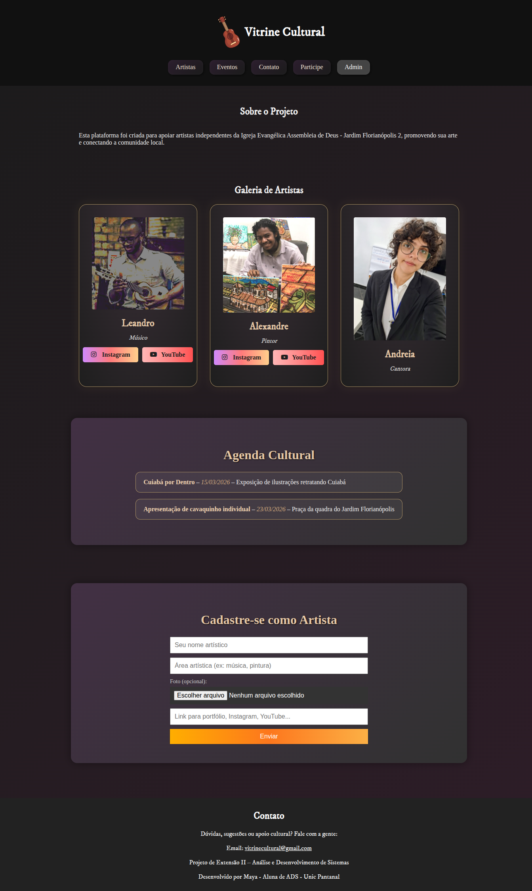
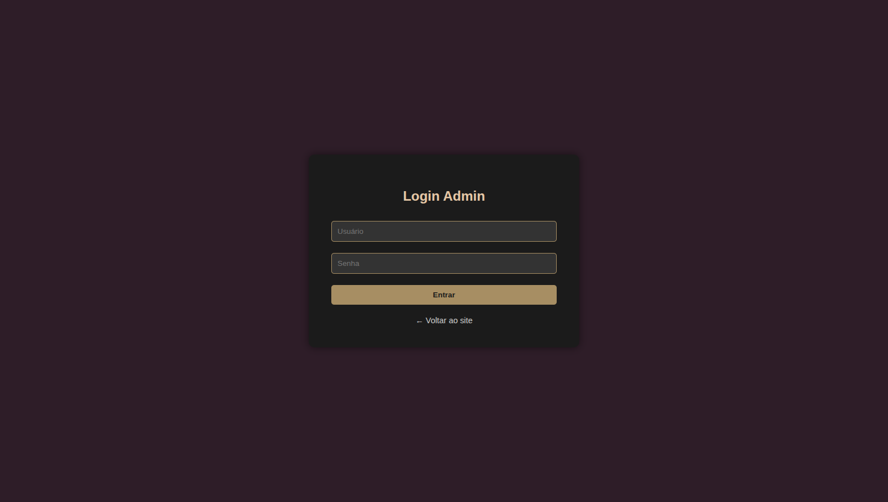
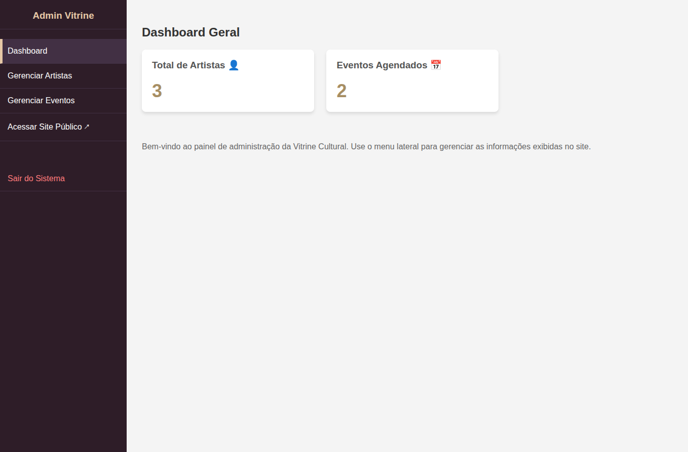
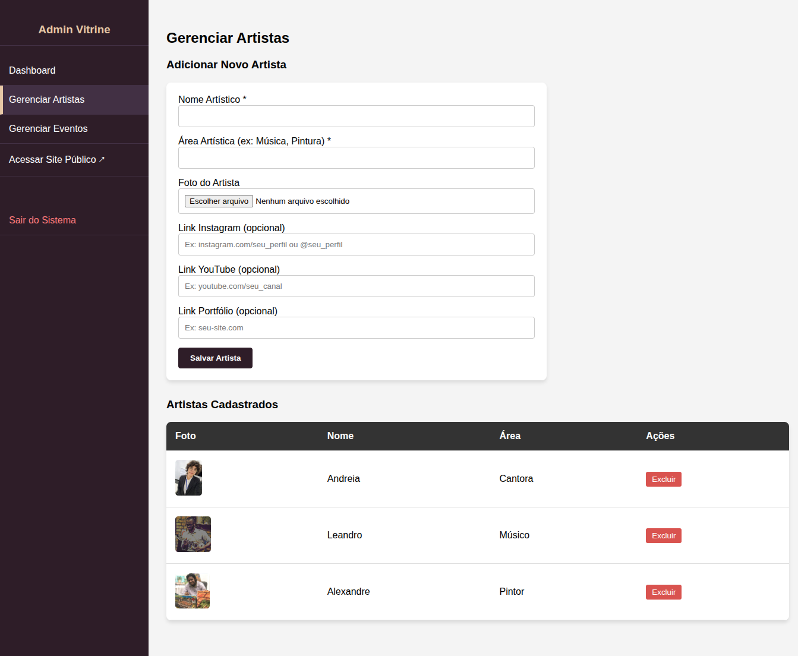
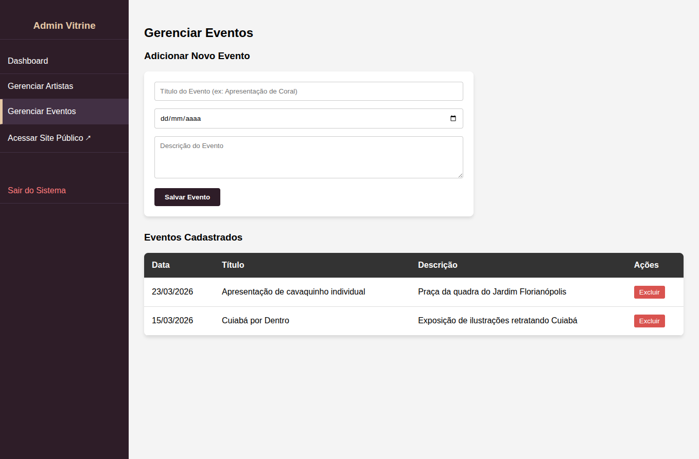

# 🎨 Vitrine Cultural – Jardim Florianópolis

Plataforma web criada para apoiar artistas independentes da Igreja Evangélica Assembleia de Deus – Jardim Florianópolis 2, promovendo sua arte e conectando a comunidade local.

**Projeto de Extensão II** – Análise e Desenvolvimento de Sistemas (Unic Pantanal)

---

## 📸 Screenshots

### Página Inicial


### Login Administrativo


### Dashboard


### Gerenciar Artistas


### Gerenciar Eventos


---

## ⚙️ Tecnologias

- **PHP** (back-end)
- **MySQL** (banco de dados)
- **HTML / CSS / JavaScript** (front-end)
- **Font Awesome** (ícones)

---

## 🚀 Como Rodar

1. **Clone o repositório:**
   ```bash
   git clone https://github.com/seu-usuario/Vitrine-Cultural.git
   ```

2. **Importe o banco de dados:**
   Execute o arquivo `database.sql` no MySQL para criar o banco e as tabelas.

3. **Configure a conexão:**
   Edite o arquivo `config.php` com as credenciais do seu banco de dados:
   ```php
   $db_host = 'localhost';
   $db_name = 'vitrine_cultural';
   $db_user = 'root';
   $db_pass = '';
   ```

4. **Inicie um servidor PHP:**
   ```bash
   php -S localhost:8000
   ```

5. Acesse `http://localhost:8000` no navegador.

---

## 📁 Estrutura do Projeto

```
├── config.php                  # Configuração do banco de dados
├── database.sql                # Script de criação do banco
├── index.php                   # Página principal
├── processar_cadastro.php      # Processamento do formulário de cadastro
├── script.js                   # Scripts do front-end
├── style.css                   # Estilos
├── images/                     # Imagens do projeto
│   └── screenshots/            # Screenshots da aplicação
└── admin/
    ├── index.php               # Dashboard administrativo
    ├── login.php               # Página de login
    ├── logout.php              # Logout
    ├── gerenciar_artistas.php  # CRUD de artistas
    ├── gerenciar_eventos.php   # CRUD de eventos
    └── upload/                 # Uploads de imagens
```

---

## 🔑 Funcionalidades

- **Galeria de Artistas** – Exibição de artistas com foto, área artística e links sociais
- **Agenda Cultural** – Lista de eventos com data e descrição
- **Cadastro de Artistas** – Formulário público para novos artistas se cadastrarem
- **Painel Administrativo** – Gerenciamento de artistas e eventos (com login protegido)

---

## 👩‍💻 Autora

Desenvolvido por **Maya** – Aluna de ADS – Unic Pantanal